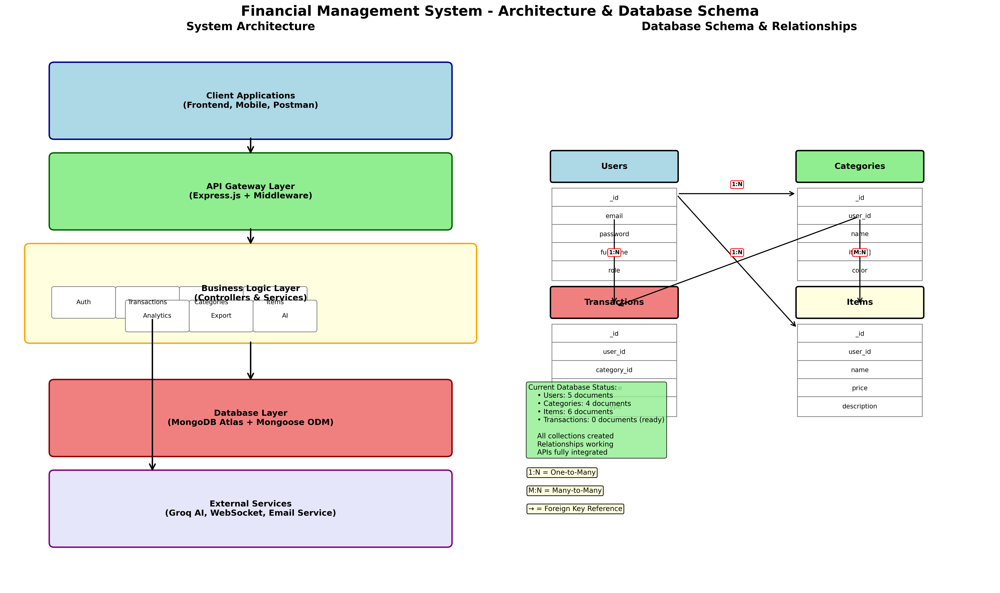

# FinTrack — Personal Finance Management App

[](LICENSE)
[](https://nodejs.org/)
[](#)

An opinionated, production-ready backend for FinTrack — a Personal Finance Management application.

- 🚀 Node.js + Express
- 🧠 MongoDB + Mongoose
- 🔐 JWT Authentication
- ⚡ WebSocket (ws) for real-time analytics
- ✉️ Nodemailer for OTP verification
- 🛒 RapidAPI integration for personalized Amazon offers
- 🧰 NodeCache for offers caching

## Table of Contents

- **Overview**
- **Features**
- **Project Structure**
- **Installation**
- **Run Locally**
- **Environment Variables**
- **API Endpoints**
- **WebSocket Events**
- **Export Formats**
- **Security & Middleware**
- **Admin**
- **License**

## Overview

FinTrack provides secure user authentication, transaction management (multi-input: text/voice/OCR), category & item CRUD, analytics that update in real time via WebSocket, Amazon-based smart offers, and admin capabilities for management.

## Features

-- Authentication: OTP email signup, JWT signin, password reset, profile updates, delete account

- Transactions: Create (Text / Voice / OCR), Read, Update, Delete, filter by category/date
- Real-time analytics: WebSocket pushes updated summaries after each transaction
- Categories & Items: Full CRUD and item assignment to categories
- Smart Offers: Personalized Amazon offers from RapidAPI, cached for 1 hour, with discount calculations
- Admin Dashboard: role-protected endpoints for user/category/item/transaction management and offers cache stats
- Export: PDF, CSV, JSON exports of transactions
- Security: Input sanitization, NoSQL injection protection, rate limiting, global error handling, request logging

## Project Structure

**Key folders and files**

- `src/` — main source
- `src/app.js` — express app bootstrap
- `src/server.js` — http server
- `src/wsServer.js` — WebSocket server
- `src/config/` — configuration modules
- `src/module/` — route modules and business logic (auth, transactions, items, analytics, offers, admin)
- `src/middleware/` — auth, rate limiter, sanitize, validation
- `DB/` — DB connection and Mongoose models
- `wsClient/` — example WebSocket client

Example:

```
src/
  app.js
  server.js
  wsServer.js
  config/
  module/
    auth/
    transactions/
    items/
    analytics/
    offers/
    admin/
  middleware/
DB/
wsClient/
```

## Architecture



Figure: FinTrack backend architecture — services, data flow, and integrations.

## Installation

Prerequisites: Node.js (>=14), npm or yarn, MongoDB instance.

1. Clone the repo

```bash
git clone <repo-url>
cd backend_V1
```

2. Install dependencies

```bash
npm install
# or
yarn install
```

3. Create a `.env` with the required environment variables (see below).

## Run Locally

Start app (development):

```bash
npm run dev
```

Start production server:

```bash
npm start
```

WebSocket server runs on the configured `WS_PORT` (or integrated with HTTP server depending on config).

## Environment Variables

| Variable        |                           Description | Example                              |
| --------------- | ------------------------------------: | ------------------------------------ |
| `MONGO_URI`     |                MongoDB connection URI | `mongodb://localhost:27017/fintrack` |
| `JWT_KEY`       |             Secret key for JWT tokens | `your_jwt_secret`                    |
| `PORT`          |                      HTTP server port | `3000`                               |
| `CORS_ORIGIN`   |            Allowed origin(s) for CORS | `http://localhost:3000`              |
| `WS_PORT`       |      WebSocket server port (optional) | `8080`                               |
| `WS_URL`        |             WebSocket URL for clients | `ws://localhost:8080`                |
| `JWT_EXPIRY`    |              JWT expiry (e.g. 7d, 1h) | `7d`                                 |
| `BASE_URL`      |      Base URL for uploaded file links | `http://localhost:3001/uploads/`     |
| `DOMAIN_URL`    |  Frontend domain used in emails/links | `http://localhost:3000`              |
| `EMAIL_SERVICE` |           Nodemailer service provider | `gmail`                              |
| `EMAIL_USER`    |        Email account for sending OTPs | `no-reply@fintrack.app`              |
| `EMAIL_PASS`    | Email account password / app password | `xxxxxxxx`                           |
| `RAPIDAPI_KEY`  |          RapidAPI key for Amazon data | `rapidapi_xxx`                       |
| `NODE_ENV`      |                      Node environment | `development` / `production`         |

## API Endpoints

All endpoints are rooted at `/` (no `/api/v1` prefix). Replace `:id` with resource id.

**Authentication**

- `POST /auth/signup` — Signup (sends OTP email)
- `POST /auth/signup/configurationOTP` — Verify OTP / finish signup
- `POST /auth/signin` — Signin (returns JWT)
- `POST /auth/forgot-password` — Request reset link/OTP
- `POST /auth/reset-password` — Reset password
- `POST /auth/change-password` — Change password (auth required)
- `GET /auth/profile` — Get profile (auth required)
- `PUT /auth/profile` — Update profile (auth required)
- `DELETE /auth/account` — Delete account (auth required)

- Note: the server expects JWT tokens in an HTTP header named `token` (not `Authorization`).

- Note: the server expects JWT tokens in an HTTP header named `token` (not `Authorization`). The server CORS allowed headers include `token` and `Authorization` (see `index.js`).

## Example .env

Create a `.env` file at the project root with values similar to the example below:

```env
MONGO_URI=mongodb://localhost:27017/fintrack
JWT_KEY=your_jwt_secret_here
JWT_EXPIRY=7d
PORT=3001
CORS_ORIGIN=http://localhost:3000
WS_PORT=3002
WS_URL=ws://localhost:3002
EMAIL_SERVICE=gmail
EMAIL_USER=no-reply@fintrack.app
EMAIL_PASS=your-email-password
RAPIDAPI_KEY=rapidapi_xxx
BASE_URL=http://localhost:3001/uploads/
DOMAIN_URL=http://localhost:3000
NODE_ENV=development
```

**Transactions**

- `POST /transactions` — Create transaction (body supports text/voice/OCR payload)
- `GET /transactions` — List transactions (query: page, limit, category, startDate, endDate)
- `GET /transactions/:id` — Get single transaction
- `PUT /transactions/:id` — Update transaction
- `DELETE /transactions/:id` — Delete transaction

Filtering examples:

- `GET /transactions?category=<id>&startDate=YYYY-MM-DD&endDate=YYYY-MM-DD`

**Category**

- `POST /category` — Create category
- `GET /category` — List categories
- `GET /category/:id` — Get category
- `PUT /category/:id` — Update category
- `DELETE /category/:id` — Delete category

**Items**

- `POST /items` — Create item
- `GET /items` — List items
- `GET /items/:id` — Get item
- `PUT /items/:id` — Update item
- `DELETE /items/:id` — Delete item
- `POST /category/:categoryId/items/:itemId` — Add item to category
- `DELETE /category/:categoryId/items/:itemId` — Remove item from category

**Analytics**

- `GET /analytics/summary` — Summary totals (today/week/month)
- `GET /analytics/by-category` — Aggregation by category
- `GET /analytics/by-date` — Time-series aggregation
- `GET /analytics/top-categories` — Top spending categories
- `GET /analytics/trends` — Trend analysis

**Smart Offers (Amazon via RapidAPI)**

- `GET /api/offers/preview` — Returns 3 personalized offers for home screen (auth required)
- `GET /api/offers` — Full offers page (supports category filter)

Behavior:

- Offers are derived from user's top spending categories and fetched via RapidAPI Amazon endpoints.
- Responses are cached with `node-cache` for 1 hour to reduce API usage.
- Discount calculation is applied server-side when price suggestions are available.

**Admin** (role: `admin`)

- `GET /admin/users` — List users
- `GET /admin/users/:id` — Get user
- `PUT /admin/users/:id` — Edit user
- `PUT /admin/users/:id/block` — Block/unblock user
- `DELETE /admin/users/:id` — Delete user
- `GET /admin/categories` — Manage categories (admin)
- `GET /admin/items` — Manage items (admin)
- `GET /admin/transactions` — View all transactions with filters
- `GET /admin/offers` — List offers cache/stats (admin)

**Export**

- `GET /export/pdf?startDate=&endDate=` — Export user transactions as PDF
- `GET /export/csv?startDate=&endDate=` — Export user transactions as CSV
- `GET /export/json?startDate=&endDate=` — Export user transactions as JSON

## WebSocket Events

The backend runs a standalone analysis WebSocket server (default port `3002`) that pushes analytics updates. Messages are plain JSON objects with a `type` and `data` fields.

- `type: "analytics_update"` — Emitted after transactions are created; `data` contains the latest home/summary analytics payload.
- `type: "connected"` — Some WS helpers may send an initial confirmation message when a client connects.

Example client flow:

1. Connect to `ws://localhost:3002` (or `WS_URL` configured in env)
2. Listen for messages and handle `type === "analytics_update"` to update UI in real time

Payload example:

```json
{
  "type": "analytics_update",
  "data": {
    "summary": { "today": 123, "month": 456 },
    "byCategory": [{ "category": "Food", "amount": 200 }]
  }
}
```

Note: the analysis WS server is started from `index.js` and uses `src/module/analysis/wsServer.js` which exposes `broadcastAnalysis(payload)` for pushing updates.


## Export Formats

- `JSON` — raw transaction objects
- `CSV` — spreadsheet-friendly with headers
- `PDF` — printable summary + table

## Security & Middleware

- Input sanitization to prevent XSS/NoSQL injection
- Rate limiting for public endpoints
- Global error handler with consistent API error shape
- Request logging for audits and debugging

## Caching & RapidAPI Usage

- Offers fetched from RapidAPI are cached using `node-cache` with a 1-hour TTL.
- Cache stats are available to admin endpoints for monitoring.

## Testing

Add unit/integration tests as needed. Use your preferred test framework (Jest, Mocha).

## Contributing

- Fork the repository
- Create feature branch
- Open a PR with clear description and tests

## License

This project is licensed under the MIT License.

---

## Postman Collection

A Postman collection for quick API testing is included at `postman_collection.json`. Import this file into Postman and set the `baseUrl` and `token` variables to run requests against your local server.

File: [postman_collection.json](postman_collection.json)

If you want, I can also add example `curl` requests or expand the Postman collection with examples for each module.
